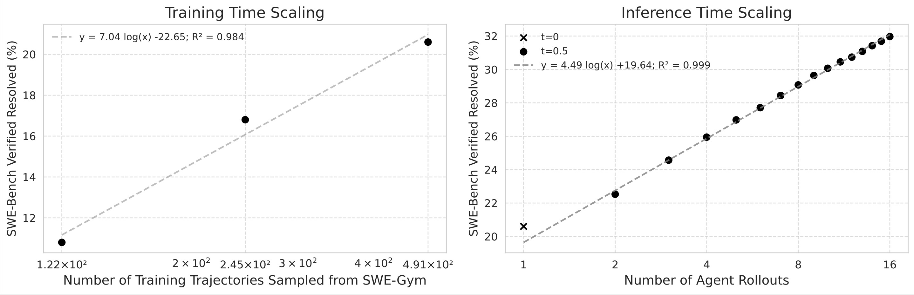
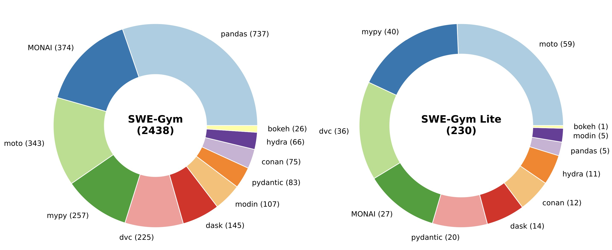
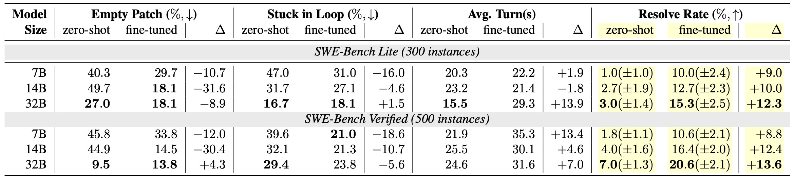
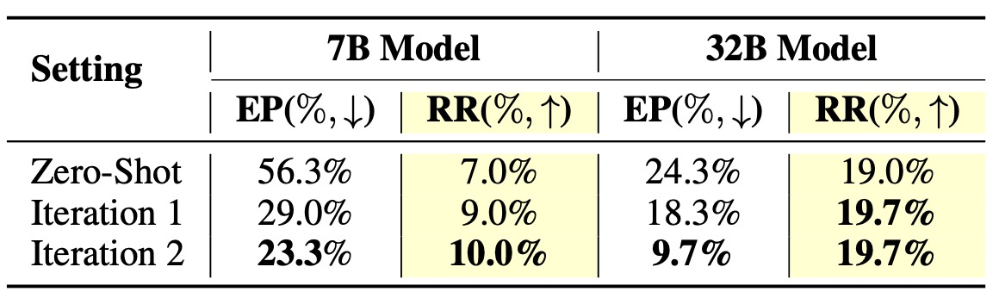
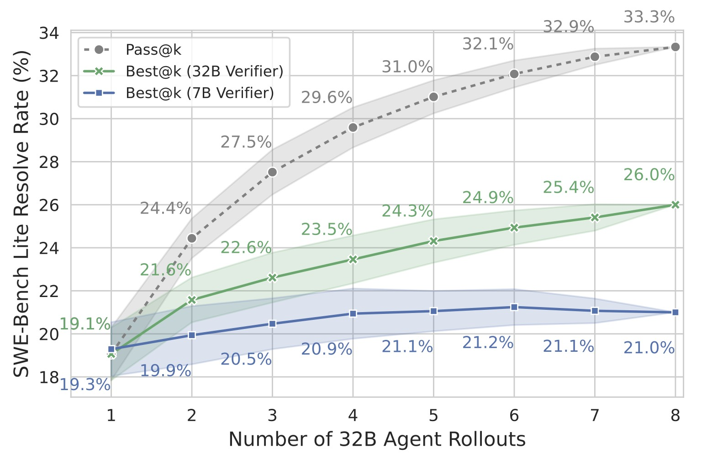
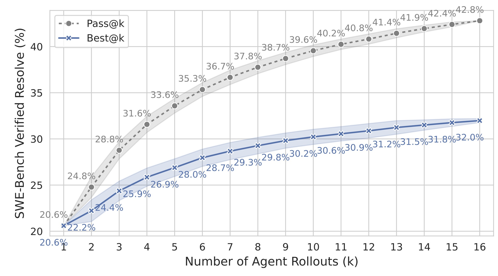

<h1 align="center"> Training Software Engineering Agents and Verifiers with SWE-Gym </h1>

<p align="center">
  <a href="https://www.jiayipan.com/" style="text-decoration: none;">Jiayi Pan<sup>*,1</sup></a>, 
  <a href="https://xwang.dev/" style="text-decoration: none;">Xingyao Wang<sup>*,2</sup></a>,
  <a href="https://www.phontron.com/" style="text-decoration: none;">Graham Neubig<sup>3</sup></a>,
  <a href="https://www.cs.toronto.edu/~ndjaitly/" style="text-decoration: none;">Navdeep Jaitly<sup>4</sup></a>,
  <a href="https://blender.cs.illinois.edu/hengji.html" style="text-decoration: none;">Heng Ji<sup>2</sup></a>,
  <a href="https://www.alanesuhr.com/" style="text-decoration: none;">Alane Suhr<sup>^,1</sup></a>,
  <a href="https://dreasysnail.github.io/" style="text-decoration: none;">Yizhe Zhang<sup>^,4</sup></a>
</p>

<p align="center">
  <sup>1</sup>UC Berkeley, <sup>2</sup>UIUC, <sup>3</sup>CMU, <sup>4</sup>Apple </br>
  <sub><sup>*</sup>Equal contribution, <sup>^</sup>Equal supervision</sub>
</p>

<p align="center">
<a href="https://arxiv.org/abs/2412.21139">📃 Paper</a>
•
<a href="https://huggingface.co/SWE-Gym" >🤗 Data & Models</a>
</p>

We present **SWE-Gym**, the first environment for training real-world software engineering agents.
We use it to train strong LM agents that achieve state-of-the-art open results on SWE-Bench, with early, promising scaling characteristics as we increase training and inference-time compute.

<p align="center">
  
</p>


---

Progress in agents for software engineering has been limited by the lack of training environments that both include rigorous verification for reinforcement learning and cover the expansive tasks encountered in real-world repository-level engineering.

We introduce SWE-Gym: An Open Environment for Training Software Engineering Agents & Verifiers.
Our baselines achieve new open SOTA - 32%/26% on SWE-Bench Verified/Lite, with promising scaling trends.


*SWE-Gym enables scalable improvements for software engineering agents at both training and inference time. Our current results is primarily bottlenecked by training and inference compute, rather than the size of our environment.*

## SWE-Gym Environment

We create SWE-Gym, the first environment for training SWE agents, with **2.4K real tasks from 11 Python repos** & a Lite split of 234 instances. SWE-Gym combines real-world Python tasks, repository context, executable environments, and test verification to train agents for solving software engineering problems.




## SWE-Gym trains LMs as agents

When fine-tuned on less than 500 agent-environment interaction trajectories sampled from it from GPT-4o and Claude 3.5 Sonnet, we achieve **+14%** absolute gains on SWE-Bench Verified with an 32B LM-powered OpenHands agent.




## SWE-Gym enables self-improvement

SWE-Gym is also effective across agent scaffolds. With rejection sampling fine-tuning and MoatlessTools scaffold, our 32B and 7B models achieve 20% and 10% respectively on SWE-Bench Lite through self-improvement.

<p align="center">
  
</p>


## SWE-Gym enables inference-time scaling 

SWE-Gym enables inference-time scaling through verifiers trained on agent trajectories.  
These verifiers identify most promising solutions via best-of-n selection, together with our learned agents, they achieve 32%/26% on SWE-Bench Verified/Lite, a new open SoTA.



*Inference Time Scaling for Moatless Agent*


*Inference Time Scaling for OpenHands Agent*


## Our baselines on SWE-Gym shows strong scaling trends

Lastly, our ablations reveal strong scaling trends - performance is now bottlenecked by train and inference compute, rather than the size of our dataset. Pushing and improving these scaling trends further is an exciting direction for future work.


## Reproducing Results
**The Dataset**

To access SWE-Gym dataset, checkout our huggingface hub page [SWE-Gym](https://huggingface.co/SWE-Gym)

The environment constants are currently saved at [SWE-Bench-Fork](https://github.com/SWE-Gym/SWE-Bench-Fork)

We also have pre-built docker images for each instance under [xingyaoww/sweb.eval.x86_64](https://hub.docker.com/search?q=xingyaoww%2Fsweb.eval.x86_64.) prefix at docker hub.

**The Experiments**
See [docs/OpenHands.md](docs/OpenHands.md) and [docs/MoatlessTools.md](docs/MoatlessTools.md) for instructions on reproducing results with our training and inference-time results for OpenHands and MoatlessTools agents.

**Generate trajectories with OpenHands for Training**
Please check out the instructions [here](https://github.com/All-Hands-AI/OpenHands/blob/main/evaluation/benchmarks/swe_bench/SWE-Gym.md)

## Awesome Work using SWE-Gym
- [Sky-RL](https://github.com/NovaSky-AI/SkyRL): Online RL for further performance improvement: OpenHands-7B-Agent 11% SR -> 14.6%	SR after RL.
- [OpenHands Critic](https://www.all-hands.dev/blog/sota-on-swe-bench-verified-with-inference-time-scaling-and-critic-model): SOTA on SWE-Bench Verified with inference-time scaling and critic Model leant on SWE-Gym.
- [OpenHands LM](https://www.all-hands.dev/blog/introducing-openhands-lm-32b----a-strong-open-coding-agent-model): OpenHands LM 32B is an agentic coding language model trained with SWE-Gym, achieving a 37% success rate on SWE-Bench Verified.

## 📚 Citation

```bibtex
@misc{pan2024trainingsoftwareengineeringagents,
      title={Training Software Engineering Agents and Verifiers with SWE-Gym}, 
      author={Jiayi Pan and Xingyao Wang and Graham Neubig and Navdeep Jaitly and Heng Ji and Alane Suhr and Yizhe Zhang},
      year={2024},
      eprint={2412.21139},
      archivePrefix={arXiv},
      primaryClass={cs.SE},
      url={https://arxiv.org/abs/2412.21139}, 
}
```
